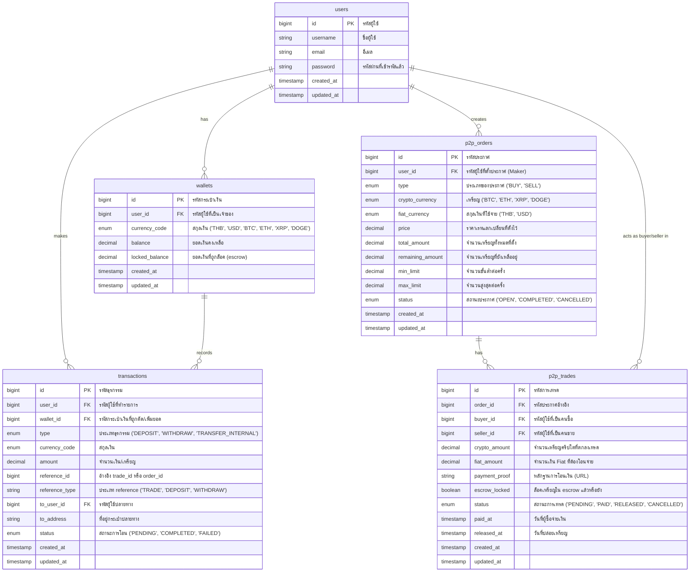

# P2P Cryptocurrency Exchange ER Diagram

```mermaid
erDiagram
    users {
        bigint id PK "รหัสผู้ใช้"
        string username "ชื่อผู้ใช้"
        string email "อีเมล"
        string password "รหัสผ่านที่เข้ารหัสแล้ว"
        timestamp created_at
        timestamp updated_at
    }

    wallets {
        bigint id PK "รหัสกระเป๋าเงิน"
        bigint user_id FK "รหัสผู้ใช้ที่เป็นเจ้าของ"
        enum currency_code "สกุลเงิน ('THB', 'USD', 'BTC', 'ETH', 'XRP', 'DOGE')"
        decimal balance "ยอดเงินคงเหลือ"
        decimal locked_balance "ยอดเงินที่ถูกล็อค (escrow)"
        timestamp created_at
        timestamp updated_at
    }

    p2p_orders {
        bigint id PK "รหัสประกาศ"
        bigint user_id FK "รหัสผู้ใช้ที่ตั้งประกาศ (Maker)"
        enum type "ประเภทของประกาศ ('BUY', 'SELL')"
        enum crypto_currency "เหรียญ ('BTC', 'ETH', 'XRP', 'DOGE')"
        enum fiat_currency "สกุลเงินที่ใช้จ่าย ('THB', 'USD')"
        decimal price "ราคาเรทแลกเปลี่ยนที่ตั้งไว้"
        decimal total_amount "จำนวนเหรียญทั้งหมดที่ตั้ง"
        decimal remaining_amount "จำนวนเหรียญที่ยังเหลืออยู่"
        decimal min_limit "จำนวนขั้นต่ำต่อครั้ง"
        decimal max_limit "จำนวนสูงสุดต่อครั้ง"
        enum status "สถานะประกาศ ('OPEN', 'COMPLETED', 'CANCELLED')"
        timestamp created_at
        timestamp updated_at
    }

    p2p_trades {
        bigint id PK "รหัสการเทรด"
        bigint order_id FK "รหัสประกาศอ้างอิง"
        bigint buyer_id FK "รหัสผู้ใช้ที่เป็นคนซื้อ"
        bigint seller_id FK "รหัสผู้ใช้ที่เป็นคนขาย"
        decimal crypto_amount "จำนวนเหรียญคริปโตที่ตกลงเทรด"
        decimal fiat_amount "จำนวนเงิน Fiat ที่ต้องโอนจ่าย"
        string payment_proof "หลักฐานการโอนเงิน (URL)"
        boolean escrow_locked "ล็อคเหรียญใน escrow แล้วหรือยัง"
        enum status "สถานะการเทรด ('PENDING', 'PAID', 'RELEASED', 'CANCELLED')"
        timestamp paid_at "วันที่ผู้ซื้อจ่ายเงิน"
        timestamp released_at "วันที่ปล่อยเหรียญ"
        timestamp created_at
        timestamp updated_at
    }

    transactions {
        bigint id PK "รหัสธุรกรรม"
        bigint user_id FK "รหัสผู้ใช้ที่ทำรายการ"
        bigint wallet_id FK "รหัสกระเป๋าเงินที่ถูกตัด/เพิ่มยอด"
        enum type "ประเภทธุรกรรม ('DEPOSIT', 'WITHDRAW', 'TRANSFER_INTERNAL')"
        enum currency_code "สกุลเงิน"
        decimal amount "จำนวนเงิน/เหรียญ"
        bigint reference_id "อ้างอิง trade_id หรือ order_id"
        string reference_type "ประเภท reference ('TRADE', 'DEPOSIT', 'WITHDRAW')"
        bigint to_user_id FK "รหัสผู้ใช้ปลายทาง"
        string to_address "ที่อยู่กระเป๋าปลายทาง"
        enum status "สถานะการโอน ('PENDING', 'COMPLETED', 'FAILED')"
        timestamp created_at
        timestamp updated_at
    }

    users ||--o{ wallets : "has"
    users ||--o{ p2p_orders : "creates"
    p2p_orders ||--o{ p2p_trades : "has"
    users ||--o{ p2p_trades : "acts as buyer/seller in"
    users ||--o{ transactions : "makes"
    wallets ||--o{ transactions : "records"
```
